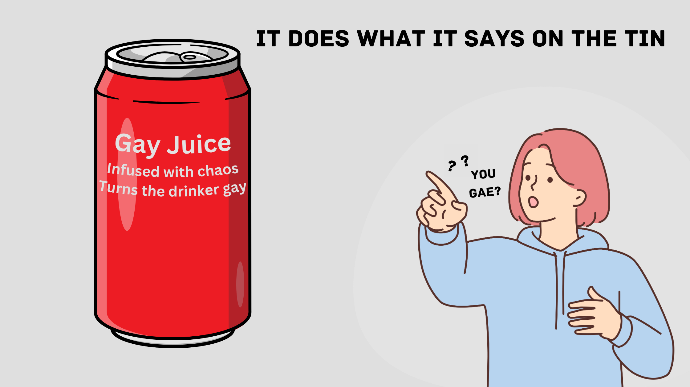

    <h1>
        
    </h1>
    <h1>
        <a href="">[🏳️‍🌈] Pointed</a>
    </h1>
    <h4><b>Oh no, It's pointing at you!</b></h4>
    <h3>
        
        
        
        
        
    </h3>

# Pointed 🫵

It's as straightforward as the pointed is probably gay!
